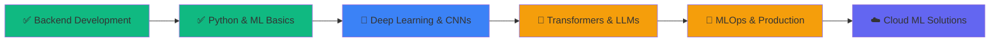

<div align="center">

<!-- Animated Header with Wave -->


<!-- Typing Animation -->


<!-- Animated Tech Icons -->
<p align="center">
  
</p>

<!-- Social Badges with Animation -->
<p align="center">
  <a href="https://linkedin.com/in/prince-raval-990a14242">
    
  </a>
  <a href="https://instagram.com/i_am_prince_raval">
    
  </a>
  <a href="https://gprm.itsvg.in/">
    
  </a>
  <a href="mailto:your.email@example.com">
    
  </a>
</p>

<!-- Profile Views Counter -->


</div>

<br/>

<!-- Animated Snake eating contributions -->
<div align="center">
  
</div>

---

## 🎯 &nbsp;About Me


```python
#!/usr/bin/env python3
# -*- coding: utf-8 -*-

class AIEngineer:
    """
    Prince Raval - Transforming code into intelligence
    """
    
    def __init__(self):
        self.name = "Prince Raval"
        self.role = "AI/ML Engineer"
        self.education = "MCA (AI & Machine Learning)"
        self.location = "Gujarat, India 🇮🇳"
        self.languages = ["Python", "PHP", "SQL", "JavaScript"]
        
    @property
    def current_work(self):
        return {
            "focus": "Building production-ready ML models",
            "exploring": ["Deep Learning", "CNNs", "Transformers"],
            "learning": ["MLOps", "Model Optimization", "LLMs"],
            "projects": ["Computer Vision", "NLP", "Predictive Analytics"]
        }
    
    @property
    def tech_stack(self):
        return {
            "ai_frameworks": ["TensorFlow", "PyTorch", "Keras", "Scikit-Learn"],
            "data_science": ["Pandas", "NumPy", "Matplotlib", "Seaborn", "Plotly"],
            "computer_vision": ["OpenCV", "PIL", "YOLO", "MediaPipe"],
            "backend": ["Django", "FastAPI", "Flask", "Laravel"],
            "databases": ["MySQL", "PostgreSQL", "MongoDB", "Redis"],
            "cloud_devops": ["AWS", "Docker", "Git", "Linux"],
            "tools": ["Jupyter", "Streamlit", "Postman", "VS Code"]
        }
    
    def say_hi(self):
        print("""
        👋 Hey there! I'm Prince Raval
        
        🚀 Journey: Backend Developer → AI/ML Engineer
        💡 Passion: Solving real-world problems with AI
        🎓 Always learning, always building
        🤝 Open to collaborate on exciting ML projects
        
        📫 Let's connect and build something amazing!
        """)

if __name__ == "__main__":
    prince = AIEngineer()
    prince.say_hi()
```

<br clear="right"/>

---

## 🔥 &nbsp;What I'm Up To

<table>
<tr>
<td width="50%" valign="top">

### 🚀 Current Focus

```yaml
🤖 AI/ML Projects:
  - Building end-to-end ML pipelines
  - Deploying models in production
  - Exploring Computer Vision with CNNs
  - Working with NLP & Transformers

📊 Data Science:
  - Predictive analytics & forecasting
  - Feature engineering & optimization
  - Data visualization & storytelling
  - Statistical analysis & A/B testing

🔧 MLOps Journey:
  - Model versioning & tracking
  - CI/CD for ML workflows
  - Model monitoring & maintenance
  - Cloud deployment strategies
```

</td>
<td width="50%" valign="top">

### 🤝 Open to Collaborate

```yaml
🌟 Looking for:
  - Machine Learning projects
  - Deep Learning research
  - Open-source AI/ML contributions
  - Data Science challenges
  - Hackathons & competitions

💡 Can help with:
  - Backend development (Laravel/Django)
  - API design & development
  - Database optimization
  - ML model deployment
  - Code reviews & mentoring

📬 Reach out:
  - GitHub Discussions
  - LinkedIn DM
  - Email collaboration
```

</td>
</tr>
</table>

---

## 💻 &nbsp;Tech Stack & Tools

<div align="center">

### 🧠 Artificial Intelligence & Machine Learning

<table>
<tr>
<td align="center" width="96">

<br>Python
</td>
<td align="center" width="96">

<br>TensorFlow
</td>
<td align="center" width="96">

<br>PyTorch
</td>
<td align="center" width="96">

<br>Keras
</td>
<td align="center" width="96">

<br>Scikit-Learn
</td>
<td align="center" width="96">

<br>OpenCV
</td>
<td align="center" width="96">

<br>Pandas
</td>
<td align="center" width="96">

<br>NumPy
</td>
</tr>
</table>

### 🌐 Backend Development & Databases

<table>
<tr>
<td align="center" width="96">

<br>PHP
</td>
<td align="center" width="96">

<br>Laravel
</td>
<td align="center" width="96">

<br>Django
</td>
<td align="center" width="96">

<br>FastAPI
</td>
<td align="center" width="96">

<br>Flask
</td>
<td align="center" width="96">

<br>MySQL
</td>
<td align="center" width="96">

<br>PostgreSQL
</td>
<td align="center" width="96">

<br>MongoDB
</td>
</tr>
</table>

### ⚙️ DevOps, Cloud & Tools

<table>
<tr>
<td align="center" width="96">

<br>Git
</td>
<td align="center" width="96">

<br>GitHub
</td>
<td align="center" width="96">

<br>Docker
</td>
<td align="center" width="96">

<br>AWS
</td>
<td align="center" width="96">

<br>Linux
</td>
<td align="center" width="96">

<br>VS Code
</td>
<td align="center" width="96">

<br>Postman
</td>
<td align="center" width="96">

<br>Jupyter
</td>
</tr>
</table>

</div>

---

## 📊 &nbsp;GitHub Analytics

<div align="center">
  
<!-- GitHub Stats Cards -->


<!-- GitHub Streak Stats -->


<!-- Activity Graph -->


<!-- GitHub Trophies -->


</div>

---

## 🎯 &nbsp;Coding Stats

<div align="center">

<!--START_SECTION:waka-->
<!-- WakaTime stats will appear here - requires setup -->
<!--END_SECTION:waka-->

<table>
<tr>
<td width="50%">

### ⚡ Recent Activity

<!--START_SECTION:activity-->
<!-- GitHub Activity will appear here -->
<!--END_SECTION:activity-->

</td>
<td width="50%">

### 📈 Weekly Development

```text
Python       12 hrs 30 mins  ████████████░░░░  65.2%
PHP          3 hrs 15 mins   ████░░░░░░░░░░░░  17.1%
JavaScript   1 hr 45 mins    ██░░░░░░░░░░░░░░   9.2%
SQL          1 hr 2 mins     █░░░░░░░░░░░░░░░   5.4%
Markdown     35 mins         ░░░░░░░░░░░░░░░░   3.1%
```

</td>
</tr>
</table>

</div>

---

## 🏆 &nbsp;Achievements & Highlights

<div align="center">

<table>
<tr>
<td align="center" width="33%">

</td>
<td align="center" width="33%">

</td>
<td align="center" width="33%">

</td>
</tr>
</table>

</div>

---

## 💡 &nbsp;Featured Projects

<div align="center">

<!-- Project Cards - Replace with your actual projects -->
<a href="https://github.com/Panther-prince/PROJECT_1">
  
</a>
<a href="https://github.com/Panther-prince/PROJECT_2">
  
</a>

<br/><br/>

<a href="https://github.com/Panther-prince/PROJECT_3">
  
</a>
<a href="https://github.com/Panther-prince/PROJECT_4">
  
</a>

</div>

---

## 📝 &nbsp;Latest Blog Posts

<!-- BLOG-POST-LIST:START -->
<!-- Blog posts will appear here - requires GitHub Action setup -->
- 🚀 Building Your First ML Pipeline with Python
- 🧠 Understanding Neural Networks: A Beginner's Guide
- 📊 Data Preprocessing Techniques for Better Models
- 🎯 From Backend to AI: My Learning Journey
<!-- BLOG-POST-LIST:END -->

➡️ [Read more blog posts...](https://your-blog-link.com)

---

## 🎮 &nbsp;When I'm Not Coding

<div align="center">

```yaml
interests:
  - 🤖 Exploring new ML/AI technologies
  - 📚 Reading research papers & articles
  - 🎓 Taking online courses & certifications
  - 🌱 Contributing to open-source
  - 💡 Building side projects
  - 🎵 Music & podcasts about tech
  - ♟️ Chess & strategic games
  - 🏃 Fitness & staying healthy
```

</div>

---

## 💬 &nbsp;Ask Me About

<div align="center">

<table>
<tr>
<td align="center">

### 🤖 AI/ML
`Machine Learning`  
`Deep Learning`  
`Neural Networks`  
`Computer Vision`  
`NLP`  
`Model Deployment`

</td>
<td align="center">

### 📊 Data Science
`Data Analysis`  
`Pandas & NumPy`  
`Data Visualization`  
`Statistical Analysis`  
`Feature Engineering`  
`EDA`

</td>
<td align="center">

### 🌐 Backend
`Laravel`  
`Django`  
`FastAPI`  
`REST APIs`  
`Database Design`  
`System Architecture`

</td>
</tr>
</table>

</div>

---

## 🌱 &nbsp;Learning Path 2025

<div align="center">



</div>

---

## ✨ &nbsp;Random Dev Quote

<div align="center">


</div>

---

## 🎵 &nbsp;Spotify Playing

<div align="center">

[](https://open.spotify.com/user/YOUR_SPOTIFY_ID)

</div>

---

## 📫 &nbsp;How to Reach Me

<div align="center">

<table>
<tr>
<td align="center" width="25%">
<a href="https://linkedin.com/in/prince-raval-990a14242">

<br/><sub><b>LinkedIn</b></sub>
</a>
</td>
<td align="center" width="25%">
<a href="mailto:your.email@example.com">

<br/><sub><b>Email</b></sub>
</a>
</td>
<td align="center" width="25%">
<a href="https://instagram.com/i_am_prince_raval">

<br/><sub><b>Instagram</b></sub>
</a>
</td>
<td align="center" width="25%">
<a href="https://gprm.itsvg.in/">

<br/><sub><b>Portfolio</b></sub>
</a>
</td>
</tr>
</table>

</div>

---

<div align="center">

### 🌟 "From building APIs to teaching machines — every line of code is a step forward!" 🚀


### 💖 Show Some Love

If you like my projects, give them a ⭐ and follow me on GitHub!  
Open to collaborations and interesting projects 🤝

[](https://github.com/Panther-prince)
[](https://github.com/Panther-prince)

---

**✨ Crafted with 💙 using [GPRM](https://gprm.itsvg.in) | Last Updated: January 2025**

</div>
